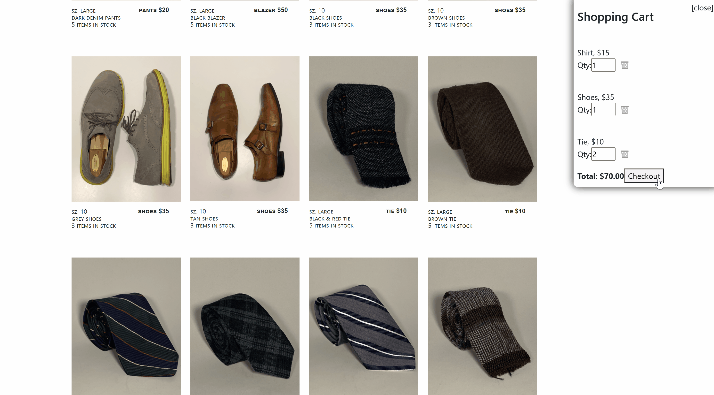

# Project 03 - TailorThrift

## Project Description 
TailorThrift is an online clothing shopping platform aimed at delivering customers well-fitting tailored outfits at a fair price. Tailorthrift lives by the ABC motto (Affordable Bespoke Clothing) because everybody deserves to look their best. Additional information can be found in the About Us and Our Mission pages on the website.

TailorThrift is a full stack MERN application where users can search different clothing options, add them to their carts, add credit card information and "purchase" those items (no actual items will be sent to the user... yet). This project contains the coding framework essential for any e-commerce website. 

# Table of Contents 
1. [Installation Information](#installation-information) [Usage](#usage)
2. [Developers](#contributors)
3. [Questions](#questions)
4. [Licensing](#licensing)
5. [Visuals of Finished Product](#visuals-of-finished-product)

## Installation Information
Install the NPM registry using the "npm run install" script in the console. This project uses a variety of NPM packages such as stripe, bootstrap, nodemailer and JWT. Please see the package.json files for exhaustive lists.

## Developers
Jeff Wymore  
Marc Pacampara  
Steven Eiselt  
Matthew Walker  
Oscar Plumridge

And a shout out to the UW Boot Camp instructional staff for helping troubleshoot issues during the development process.

## Questions 
Please refer to the GitHub for the source code. Please visit the page for information on how to contact the developers.  
Github account: https://github.com/StevenEi/Project-03-TailorThrift   
Launched Project: https://tailorthrift.herokuapp.com/  
    
## Licensing 
No licensing currently.

## Visuals of Finished Product

  
  
  
  
  
